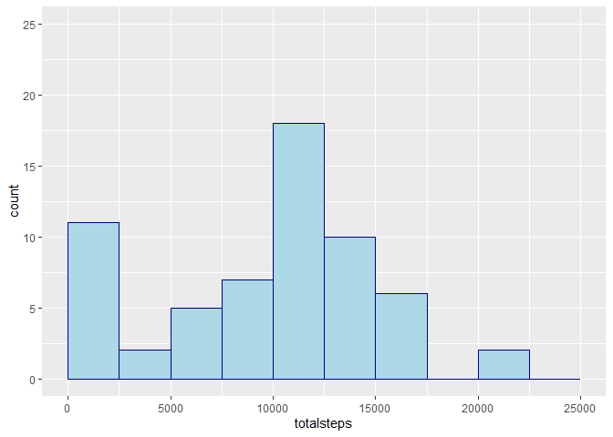
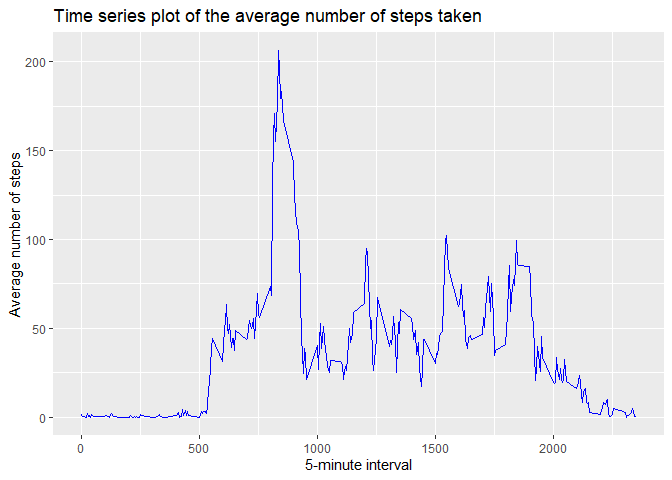
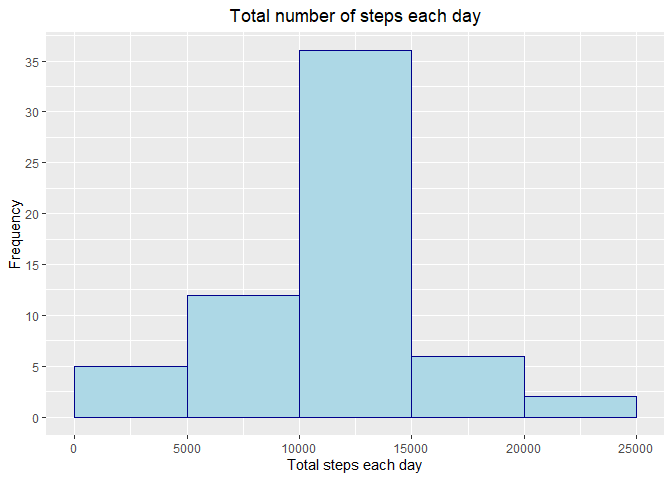
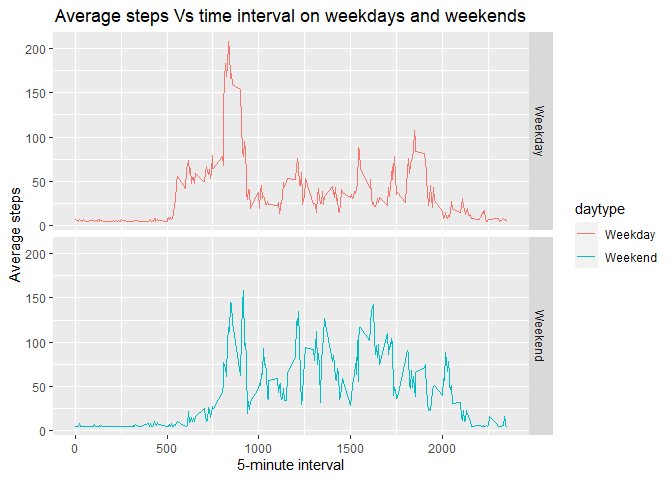

## Loading and preprocessing the data

```r
data <- read.csv("activity.csv")
```

## What is mean total number of steps taken per day?

```r
library(dplyr)
total_sum <-aggregate( data$steps, by = list(data$date), FUN = sum, na.rm = TRUE)
```
Renaming the column names

```r
library(dplyr)
total_sum <- rename(total_sum, date = "Group.1", totalsteps = "x" )
```
plotting

```r
library(ggplot2)
g <- ggplot(total_sum, aes(totalsteps))
g + geom_histogram(binwidth = 2500, boundary = 0, col = "dark blue", fill = "light blue") +
  xlim(0,25000) +
  ylim(0,25)
```

<!-- -->
The mean of the total number of steps taken per day:

```r
mean(total_sum[["totalsteps"]])
```

```
## [1] 9354.23
```

The median of the total number of steps taken per day:

```r
median(total_sum[["totalsteps"]])
```

```
## [1] 10395
```


## What is the average daily activity pattern?

```r
average_steps <- aggregate(data$steps, by = list(data$interval), FUN = mean, na.rm = TRUE)
```
Renaming the columns

```r
library(dplyr)
average_steps <- rename(average_steps, interval = "Group.1", average = "x")
```
The 5-minute interval, which on average across all the days in the dataset, contains the maximum number of steps

```r
average_steps$interval[which.max(average_steps$average)]
```

```
## [1] 835
```

plotting

```r
library(ggplot2)
g <- ggplot(data = average_steps, aes(interval, average))
g + geom_line(col = "blue") +
  ggtitle("Time series plot of the average number of steps taken")+
  labs(x = "5-minute interval", y = "Average number of steps")
```

<!-- -->

## Imputing missing values
Total number of missing values in the dataset

```r
sum(is.na(data))
```

```
## [1] 2304
```
I will fill the missing values with mean of the already calculated mean steps per interval. These already calculated means are in object called average_steps.

```r
mean <- mean(average_steps$average)
newdata <- transform(data, steps = ifelse(is.na(steps), mean, steps))
```

now calculating total number of steps taken each day with the help of aggregate() and then renaming the columns of the resulting dataframe.

```r
library(dplyr)
total_steps_each_day <- aggregate(newdata$steps, by = list(newdata$date), FUN = sum) %>% 
  rename(date = "Group.1", totalsteps = "x")
```
Making the histogram of the total number of steps taken each day

```r
library(ggplot2)
g <- ggplot(total_steps_each_day, aes(totalsteps))
g + geom_histogram(binwidth = 5000, boundary = 0, col = "dark blue", fill = "light blue")+
  scale_y_continuous(breaks = seq(0,35, by = 5)) + 
  ggtitle("Total number of steps each day") +
  labs(x = "Total steps each day", y = "Frequency") +
  theme(plot.title = element_text(hjust = 0.5))
```

<!-- -->
The mean aof the total number of steps taken per day;

```r
mean(total_steps_each_day[["totalsteps"]])
```

```
## [1] 10766.19
```
The median of the total number of steps taken per day;

```r
median(total_steps_each_day[["totalsteps"]])
```

```
## [1] 10766.19
```

## Are there differences in activity patterns between weekdays and weekends?
Creating a new factor variable in the dataset with two levels - "weekday" and "weekend" indicating whether a given date is a weekday or weekend day.

```r
newdata$gooddate <- as.Date(newdata$date, format = "%Y-%m-%d")
newdata$weekdays <- weekdays(newdata$gooddate)
newdata$daytype <- ifelse(newdata$weekdays == "Saturday" | newdata$weekdays == "Sunday",
                          "Weekend", "Weekday")
```
Two time series plot of the 5-minute interval (x) and the average number of steps taken averaged across weekday days or weekend days (y).
First, grouping newdata dataset by interval. 

```r
newdata2 <- aggregate(newdata$steps, by = c(list(newdata$interval),list(newdata$daytype)),
                      FUN = mean,na.rm = TRUE) %>% rename(interval = "Group.1", 
                                                          daytype = "Group.2",
                                                          mean = "x")
```
Plotting

```r
library(ggplot2)
g <- ggplot(newdata2, aes(interval, mean))

g + geom_line(aes(color = daytype)) + facet_grid(daytype~.) + 
  ggtitle("Average steps Vs time interval on weekdays and weekends") +
  labs(x = "5-minute interval", y = "Average steps") +
  theme(plot.title = element_text(hjust = 0.5)) 
```

<!-- -->


